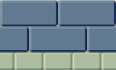
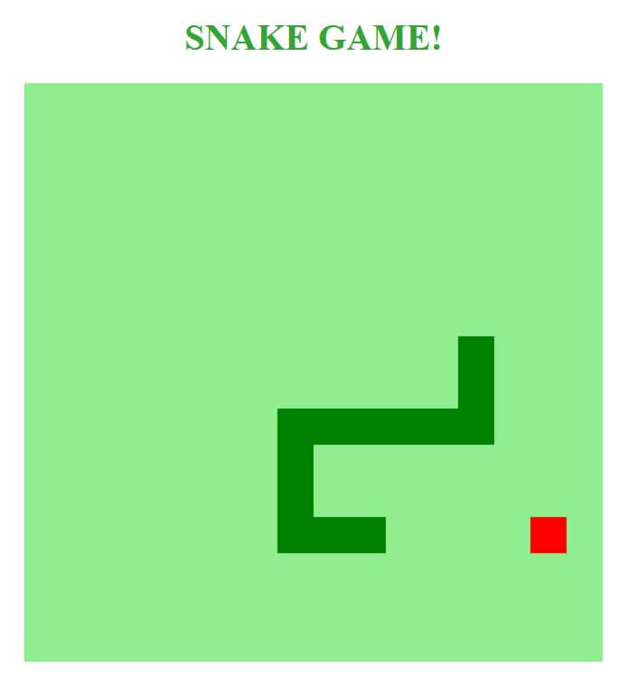
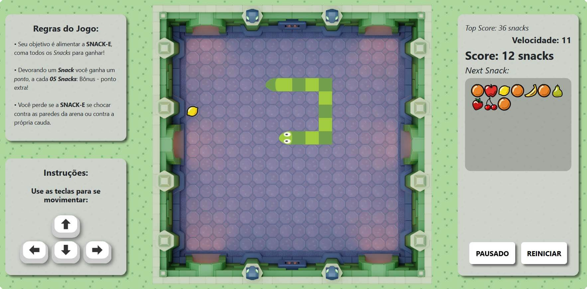
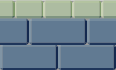

PROJETO  FINAL DO BOOTCAMP: ***HTML WEB DEVELOPER*** DA DIO

**Desenvolvido por:** *Thiago de Oliveira Miranda*

***

<h2 align="center">

  **O JOGO DA COBRINHA  ( *The Snake Game* )**

</h2>

***

&emsp;&emsp;O exercício proposto consistia em recriar o famoso jogo da *cobrinha*, visando familiarizar com o básico da estrutura de código do Javascript. Sendo prerrogativas do exercício a implementação de um *loop* de jogo, condições de incremento e regras de fim de jogo.

***

### **Exercício apresentado:**
 

 

***

 

&emsp;&emsp;Parte importante e adicional da atividade é customizar o código, adicionando melhorias e características próprias com ênfase no aprendizado e na aplicação de novos métodos e funções do Javascript.

 

***

<h2 align="center">

  **MELHORIAS IMPLEMENTADAS**

</h2>

### **Resultado obtido:**
 

              
 

&emsp;&emsp;* [x]  Aumento gradativo da velocidade a cada ponto.              
&emsp;&emsp;* [x]  Placar marcador de pontos.
* [x]  Placar de melhor resultado "*TopScore*".
* [x]  Implementação de "Sprite sheet" para a snake e comidas.
* [x]  Condição que identifica a direção e atribui o sprite adequado da cabeça.
* [x]  Funcionalidade que alterna as cores da corpo.
* [x]  Troca de sprite da cabeça quando a snake morre.
* [x]  Lógica que identifica o último elemento do array "snake[]" e seu vizinho imediato e atribui o sprite da cauda.
* [x]  Implementação de imagem no background do canvas.
* [x]  Implementação de trilha sonora e efeitos sonoros.
* [x]  Painel lateral marcador de comidas, utilizando o método "createElement".
* [x]  Funcionalidade que desativa o scroll das setas do teclado.
* [x]  Funcionalidade que captura os inputs das teclas e as apresenta no mostrador.
* [x]  Lógica de bônus - a cada 05 pontos.
* [x]  Lógica que permite zeros à esquerda de números menores que 10 nos placares.
* [x]  Condição que zera o mostrador de comidas quando o mesmo chega a seu limite.
* [x]  Condição que atribui a característica "piscar" à comida atual no marcardor.
* [x]  Condição que previne que a comida seja gerada no mesmo local do corpo da snake.
* [x]  Novas regras de fim de jogo, não permitindo se chocar com os limites da arena.
* [x]  Implementação do botão "Jogar / Pausar".
* [x]  Implementação do botão "Reiniciar" atualizando o "TopScore".                                               
 

***

 

### **POSSÍVEIS MELHORIAS FUTURAS** 

 

* [ ]  Aplicação da responsividade para diversos dispositivos.
* [ ]  Implementação de jogabilidade para dispositivos mobile.

 

***

